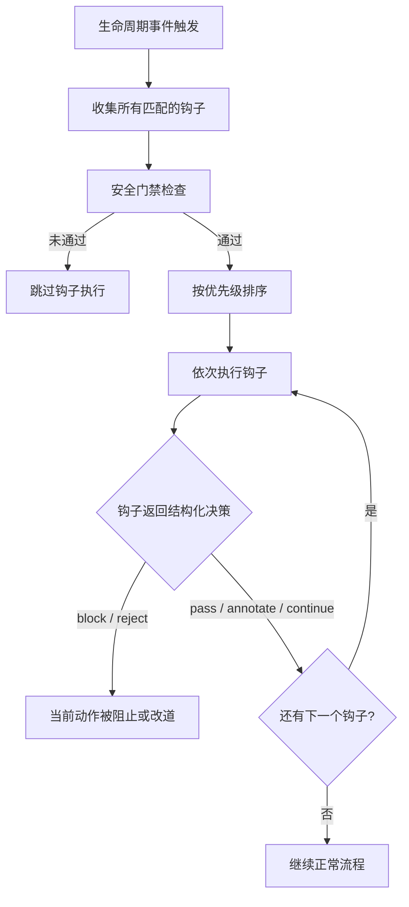
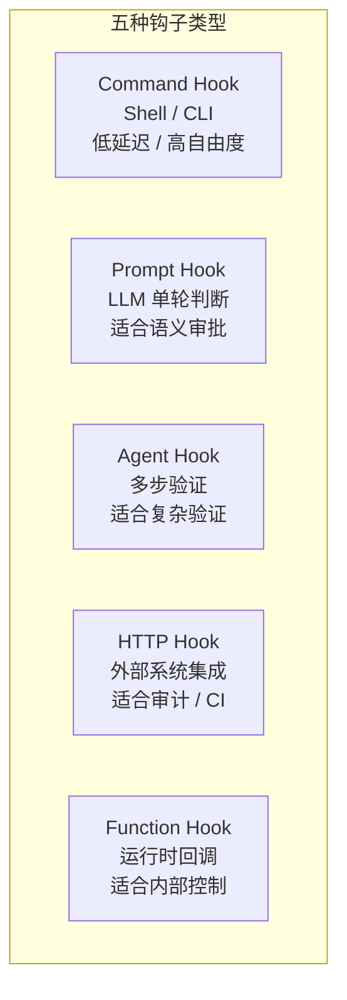
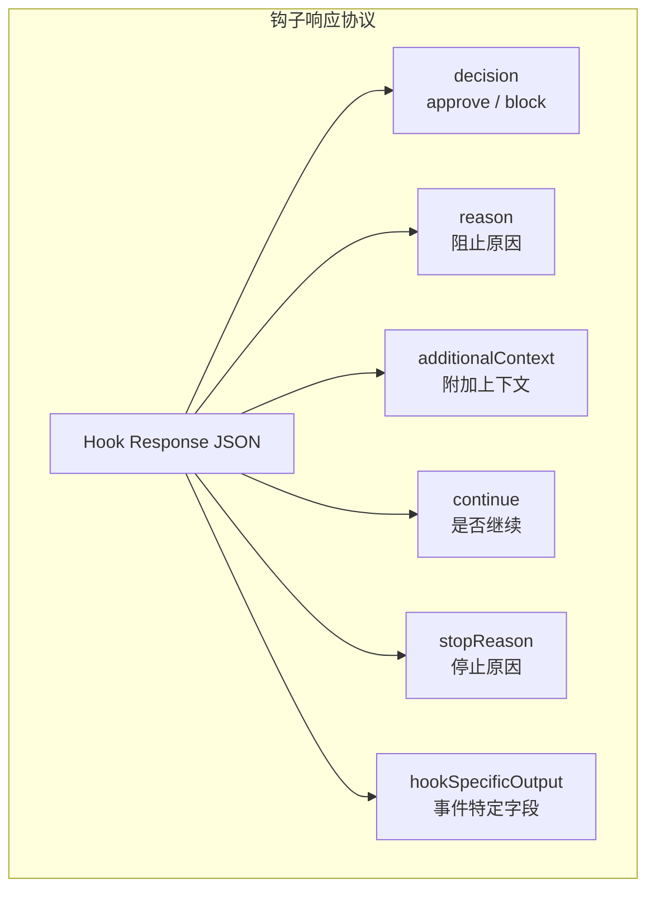
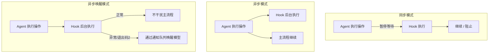

这篇文章最初来自我读 **Claude Code Book** 里关于 hooks 的那一章，让我第一次把 hooks 这件事从“扩展脚本”理解成“生命周期扩展点系统”，实际做项目的时候则逼着我不断去追问：一个真正可演进的 code agent，到底要不要有 hooks，如果要有，它应该长成什么样。

我的实训项目源地址：[1024xengineer.github.io/neo-code/](https://1024xengineer.github.io/neo-code/)

**一个基于 Golang 的 `agent`，欢迎体验和 `Star`。**

如果说 permission 是 Agent 的护栏，workflow 是骨架，tool 是手脚，那么 hooks 更像是一层遍布全身的“神经系统”。

hooks 作为代码智能体（code agent）生命周期的核心扩展机制，其价值远不止 “扩展脚本” 那么简单。从 Claude Code Book 中关于 hooks 的设计思路出发，结合 code agent 的实际研发实践，能够清晰看到：一套成熟的 hooks 系统，是 code agent 从 “能运行” 走向 “可演进” 的关键支撑。

---

## hooks 是什么：

很多人第一次听到 hooks，会把它理解成“给用户执行一段脚本的入口”或者“某个产品的插件能力层”。这当然不算错，但如果只停在这个层面，其实会把 hooks 想窄。

hooks 首先不是一个产品按钮，而是一种**系统内部扩展机制**。更准确一点说：

> hooks 是 runtime 生命周期关键节点上的扩展点机制。它允许系统在固定时机插入额外逻辑，用于观察、拦截、附加判断、补充上下文、记录信息或增加 guard。

这里最重要的词有两个：**固定时机** 和 **额外逻辑**。

它不是“我想在哪跑点逻辑就在哪跑”，而是挂在有限的生命周期事件上；它也不是“第二套 runtime”，不是再造一个主流程层。它做的是主逻辑之外的事：给系统在关键节点加一层可插拔、可收敛、可观测的判断与增强。

我更偏向于把它理解成一层 **middleware / extension layer**。不是新的业务模块，不是新的控制平面，而是在 runtime 执行过程中，为关键节点暴露一组扩展接口。

如果把这件事说得更直白一点：

> hooks 不是主逻辑本身，而是主逻辑运行过程中的扩展接口。

---

## code agent 迟早会需要 hooks

一个 agent 在很早期的时候，其实不太会强烈感受到 hooks 的必要性。那时候系统还很简单，很多需求直接写在 run loop 里就行：收到用户输入，调模型，执行 tool，收工具结果，再调模型，最后结束。哪怕多几层判断，主循环也还能撑得住。

但一旦 agent 复杂起来，hooks 的必要性会迅速浮出来。

因为你会不断遇到这种逻辑：

- tool 调用前，检查这次操作是不是高风险
- tool 返回后，补一段审计或结果摘要
- final 前，再跑一轮 verify，别让模型凭一句“我完成了”就结束
- step 结束后，统计 token、写 telemetry、决定是否 compact
- 权限判断前，补充更细的上下文或风险标签
- 子代理结束后，检查结果是否真的能进入主流程
- 上下文压缩前，把某些关键信息强行保留
- 会话结束时，做 checkpoint、做摘要、清理状态

这些逻辑都很真实，也都很合理。但它们有一个共同点：**不是主动作本身，却总是在某个时机必须发生。**

这就是 hooks 真正的切入点。

如果没有 hooks，这类逻辑只能继续写在 runtime 主链路里。时间一长，run loop 里就会堆满“顺手做一下”“这里加个判断”“这里再兜底一下”这种代码。最后系统不是不能跑，而是越来越难扩展、越来越难拆分、越来越难向别人解释。

所以 hooks 的第一个价值，其实不是“给用户更多自由”，而是：

> **把 runtime 中那些依赖固定时机触发、但不应继续硬编码在主循环里的附加逻辑，解耦成统一的生命周期扩展点。**

再往后看，hooks 还有第二个价值：**系统演进能力**。

一个没有 hooks 的 agent，每加一种策略都得改核心循环。一个有 hooks 的 agent，则可以把越来越多“在固定节点发生”的事情，放进稳定的扩展接口里。这就是为什么我会觉得：

> hooks 对 code agent 来说，不只是一个功能点，而是一种“从能跑走向可演进”的结构能力。

---

## hooks 的边界

只要开始认真设计 hooks，这个问题一定会出现：它和别的模块到底怎么分工？

舆书中的一种划分是这样的：

- **Tool**：负责具体动作执行，解决“做什么动作”
- **Permission**：负责授权与风险控制，解决“这个动作能不能做”
- **Workflow**：负责流程编排，解决“整体流程怎么走”
- **Rules**：负责约束和限制，解决“系统要遵守什么规则”
- **Hooks**：负责在生命周期关键节点插入附加逻辑，解决“在什么时机增加额外判断或增强”

也就是说，hooks 本身不直接承担工具执行、权限拍板、流程推进这些核心职责。它更像一层挂在这些模块之间的 **middleware / extension layer**：

> tool / permission / workflow / rules 是主逻辑层，hooks 是挂在主逻辑层之间的扩展点层。

所以 hooks 可以：

- 影响输入
- 阻断继续
- 增加上下文
- 补充观测
- 增加 guard
- 调整某些事件上的附加行为

但 hooks **不应取代主逻辑模块成为新的真源**。否则它就不再是扩展点，而是第二套 runtime。······

> hooks 适合做附加逻辑和 guard，不适合直接成为最终拍板层。

比如：

- tool 真正怎么执行，应该由 tool executor 负责
- permission 最终是否放行，应该由 permission engine 收口
- workflow 怎么推进，应该由 runtime / scheduler 决定
- completed / failed / continue / incomplete 的最终裁决，应该由 decider 收口

hooks 可以参与，可以影响输入，可以做 pre-check / post-check，但不应该吞掉这些模块的主权。

---

## hooks 的设计

设计 hooks 最自然的方式，不是先问“支持 shell 还是 HTTP”，而是先问：

> 这个 agent 的生命周期里，到底哪些节点值得被开放成扩展点？

也就是：**先做 events，再谈 handlers。**

这其实是 hooks 系统真正的骨架。因为只有先把生命周期事件定义清楚，hooks 才有地方可挂；只有先知道系统在哪些时机暴露出稳定节点，才能进一步讨论哪些 hook 可以观察、哪些 hook 可以阻断、哪些 hook 只能异步执行。即：

这张图里最关键的不是“钩子很多”，而是：

1. hooks 一定是**事件驱动**
2. hooks 执行前要过**安全门禁**
3. hooks 之间要有**优先级和顺序**
4. hooks 的输出要能被系统**结构化消费**

一旦接受“生命周期先行”的思路，接下来的问题就是：agent 到底有哪些关键事件？

如果从一个完整 code agent 的执行过程来看，hooks 的生命周期成大概是下面几层。

### 会话层

这是最外层的生命周期：

- `SessionStart`
- `SessionEnd`

它关心的是：一次会话什么时候开始、什么时候结束、如何初始化环境、如何收尾。

### 用户交互层

这是用户和 agent 之间最直接的入口和出口：

- `UserPromptSubmit`
- `Notification`
- `Stop`
- `StopFailure`

它关心的是：用户输入什么时候进入系统、Agent 回答什么时候结束、系统需要什么时候提醒用户。

### 工具调用层

这是 hooks 最有力量的一层，也是 code agent 最常用的一层：

- `PreToolUse`
- `PostToolUse`
- `PostToolUseFailure`

它关心的是：工具调用前能不能拦、调用后要不要补充处理、失败后要不要上报或改道。

### 子代理层

如果系统支持 subagent，这一层就很重要：

- `SubagentStart`
- `SubagentStop`

它让你能观察和干预“任务委托给子代理”这件事。

### 压缩层

这层经常被低估，但对长上下文 agent 很关键：

- `PreCompact`
- `PostCompact`

它决定了上下文压缩前后能不能插入自定义规则、保护关键记忆、检查摘要质量。

### 权限与配置层

这层更偏控制与治理：

- `PermissionRequest`
- `PermissionDenied`
- `ConfigChange`
- `Setup`

### 环境与其他层

还有一些更分散但很有价值的点：

- `Elicitation`
- `ElicitationResult`
- `CwdChanged`
- `FileChanged`
- `InstructionsLoaded`

如果把这些串成一张图，就是：

```mermaid
flowchart TD
    subgraph 会话层
        SessionStart["SessionStart"] --> UserLoop["用户交互循环"]
        UserLoop --> SessionEnd["SessionEnd"]
    end

    subgraph 用户交互层
        UserPromptSubmit["UserPromptSubmit"] --> AgentProcess["Agent 处理"]
        AgentProcess --> Stop["Stop / StopFailure"]
    end

    subgraph 工具调用层
        PreToolUse["PreToolUse"] --> ToolExec["工具执行"]
        ToolExec --> PostToolUse["PostToolUse / PostToolUseFailure"]
    end

    subgraph 子代理层
        SubagentStart["SubagentStart"] --> SubagentExec["子代理执行"]
        SubagentExec --> SubagentStop["SubagentStop"]
    end

    subgraph 压缩层
        PreCompact["PreCompact"] --> CompactExec["压缩执行"]
        CompactExec --> PostCompact["PostCompact"]
    end
```

它们让系统第一次能认真回答：

- 哪些地方允许插 hook？
- 哪些 hook 能阻断？
- 哪些只能观察？
- 哪些适合注入上下文？
- 哪些适合异步上报？
- 哪些适合长时间运行、只在异常时回灌？

也就是说，生命周期事件不是 hooks 的附属品，而是 hooks 真正的骨架。

---

## hooks 的类型

hooks 的核心价值是 “适配不同复杂度、安全边界、延迟模型的扩展场景”，而非单一的 “脚本执行”。基于应用场景，hooks 可分为五类核心类型：

### Command Hook

最常见的一类。执行 shell 命令，适合：

- 脚本检查
- 条件审批
- 文件系统操作
- 调外部命令行工具

它的优点是简单直接，延迟低，表达力强；风险是边界容易膨胀。

### Prompt Hook

让 LLM 做一次单轮判断，适合：

- 内容审核
- 语义级审批
- 很难用硬编码规则表达的判断

它比正则和脚本更“智能”，但也更不可预测。

### Agent Hook

不是单轮 prompt，而是一个多步的 agentic verifier。适合：

- 测试验证
- 多步骤质量检查
- 复杂完成条件

这类 hook 已经很接近“一个小 agent”了。

### HTTP Hook

把钩子输入 POST 到外部服务，适合：

- 审计系统
- CI/CD 集成
- 企业审批服务
- 通知系统

它的价值在于外部集成，而不是本地判断。

### Function Hook

运行时内存里的回调函数，不能持久化，适合：

- SDK 嵌入模式
- 运行时深度交互
- session 级的动态控制

它更像 internal hooks 的天然载体。

可以用一张图快速概括：

真正成熟的 hooks 系统，不应该只有一种“脚本型 hook”，而应该允许不同复杂度、不同安全边界、不同延迟模型的 hooks 共存。

---

## 结构化响应

hooks 的输出需遵循 “结构化响应协议”—— 零散的字符串输出无法被系统有效消费，只有标准化的响应格式，才能实现 “观察 - 拦截 - 增强” 的核心目标。

为什么？

因为 hooks 不是只想“说点什么”，而是需要明确表达：

- 允许还是阻止
- 是否需要继续
- 是否附加上下文
- 是否修改特定输入
- 是否覆盖某类输出
- 是否追加理由和标签

### 第一层：非结构化输出

- stdout
- stderr

这层用于：

- 日志
- 调试
- 用户可见信息

### 第二层：结构化 JSON 响应

这层用于：

- 系统级控制
- 明确返回 decision / reason / additionalContext / continue
- 返回事件特定字段

大概是这样：

### 字段

#### decision

最基础的字段。用于表达：

- approve
- block

它把“钩子意见”从文字提升成了结构化控制信号。

#### reason

如果 block，需要解释原因。这对用户体验和调试都非常重要。

#### additionalContext

核心的 “增强能力” 字段，用于为核心流程补充上下文

例如：

- SessionStart 注入项目状态
- PostToolUse 注入工具结果摘要
- UserPromptSubmit 注入 repo 规则
- BeforeVerification 注入额外约束

#### updatedInput

这是一个强能力字段。它允许 hook 修改即将传给工具的输入。

允许钩子修改即将传入核心模块的输入，例如自动补充安全参数、修正工具调用格式。需注意 “透明性” 与 “可审计性”，避免静默修改破坏用户预期。

#### continue / stopReason

精细化控制字段，尤其适用于`Stop`、`BeforeCompletionDecision`等事件，hooks 不只是判断“要不要 block”，还可以表达：

- 是否继续
- 为什么停止
- 是否需要把模型拉回主循环再跑一轮

这比简单的 0/1 返回精细得多。

---

## 退出码和结构化响应

hook 的行为不是只由退出码决定，也不是只由 JSON 决定，而是两者协同。

也就是说，hooks 同时兼容两种世界：

- 命令行世界：退出码有强语义
- 结构化控制世界：JSON 字段有强语义

例如：

- 退出码 `0`：正常通过
- 退出码 `2`：主动阻止，并把 stderr 注入模型
- 其他非 `0`：警告但继续

与此同时，如果 JSON 里有明确的 `decision: block`，系统也可以按结构化字段优先阻止。

这套设计很妙，因为它让 hooks 既能被脚本快速实现，又能被 runtime 精细消费。

---

## 同步、异步、asyncRewake

hooks 的执行模式需适配不同的延迟与阻塞需求，分为三类核心模式：

### 同步模式

默认模式。当前动作暂停，等 hook 执行完，再决定是继续还是阻止。

- 适用于：
  - 权限审批；
  - 安全校验（guard）；
  - 前置检查（pre-check）；
  - 关键路径的验证（verify）。

### 异步模式（`async: true`）

钩子后台运行，不阻塞当前操作，结果也不直接反馈给模型。

- 适用于：
  - 日志记录；
  - 遥测数据上报（telemetry）；
  - 审计信息推送；
  - 通知发送；
  - 结果归档。

### 异步唤醒模式（`asyncRewake: true`）

它也是后台执行，不阻塞主流程，但当钩子以特定异常语义结束时，可以**唤醒模型继续对话**。

- 适用于：
  - 长时间运行的监控任务；
  - 外部状态的后台观察；
  - 长耗时验证逻辑；
  - 条件触发式的模型回调（如异常状态提醒）。

可以画成这样：

这里最关键的一点是：

> **异步钩子通过通知队列与主循环交互，不会阻塞 Agent 执行。**

这本质上已经是 hooks 和 runtime 的一种“弱耦合异步协作”。

---

## 配置、匹配器与优先级

成熟的 hooks 系统需解决 “配置来源、匹配规则、优先级排序” 等治理问题，避免扩展逻辑混乱。

### hooks 来自多个来源

例如：

- 用户配置（user settings）；

  项目配置（project settings）；

  本地配置（local settings）；

  插件钩子（plugin hooks）；

  内置钩子（builtin hooks）；

  会话钩子（session hooks）。

###  通过 matcher 精确命中

- 钩子并非 “事件触发即全量执行”，而是通过匹配器精准命中：
  
  - 匹配特定生命周期事件；
  - 匹配特定工具类型；
  - 匹配特定输入格式 / 内容；
  - 匹配特定子类型。
  
  只有满足匹配条件的钩子，才会被执行。

### 明确优先级

例如：

- user > project > local > plugin > builtin > session

这不是实现细节，而是治理问题。如果没有优先级，hooks 会很快变成“谁后注册谁说了算”的隐形混乱。

这背后其实体现了两个原则：

1. hooks 是“组合”的，不是“单点替代”的
2. hooks 必须有清晰的主权层级

---

## 安全门禁：hooks 最容易被低估的部分

hooks 的安全风险控制是易被低估但至关重要的环节，需构建多层防护体系：

### 1. 全局禁用开关

系统需提供总开关，当 hooks 出现安全事件、配置错误或企业合规要求时，可直接关停全部 hooks。

### 2. 仅托管模式

支持 “仅运行管理员 / 系统托管 hooks” 的模式，屏蔽用户项目配置中的自定义 hooks，降低恶意逻辑风险。

### 3. 工作区信任机制

仓库级 hooks（repo hooks）不默认执行 —— 用户克隆陌生仓库后，系统不会自动运行其定义的钩子逻辑需用户显式建立信任关系。

### 4. 最小权限原则

所有钩子执行需遵循 “最小权限”：

- 仅暴露必要的上下文信息；
- 仅开放白名单环境变量；
- 不默认授予密钥 / 敏感权限；
- 不默认允许执行任意命令；
- 每一次执行均可审计、可追溯；
- 每一次触发均可视化。

> 仓库级 hooks 的执行需建立在 “显式信任” 之上，而非隐式继承。

---

## 为什么会话钩子适合用 `Map`

从工程实现角度，会话级钩子（session hook）、子代理钩子（subagent hook）的存储推荐使用`Map`而非`Record`，核心原因是：

- `Map.set()`的时间复杂度为 O (1)，适配高频增删场景；

  更适合会话级动态注册 / 注销钩子的场景；

  避免对象展开导致的额外性能开销；

  在并发 / 多 agent 场景下稳定性更高。

这一选择印证了 hooks 设计的核心特征：**既需架构层面的逻辑设计，也需落地到具体的工程细节**—— 数据结构的选择直接影响系统的正确性与性能。

---

## 常见设计陷阱

hooks 系统设计中需规避四类核心陷阱：

### 1. 同步钩子过重

若工具调用前的同步钩子执行耗时过长，会直接阻塞 Agent 运行，即便架构设计优雅，也会导致系统可用性下降。

### 2. 滥用`updatedInput`字段

静默修改输入虽能增强安全性（如自动补充安全参数），但会破坏用户预期（用户预期执行 A，实际执行 B），引入审计与心智负担。

### 3. 钩子间循环依赖

若钩子 A 触发钩子 B，钩子 B 又触发钩子 A，会导致系统逻辑形成不可解释的循环，降低可维护性。

### 4. 取代核心模块的决策主权

若 hooks 直接接管 permission、workflow、tool executor 等核心模块的最终决策，会从 “扩展层” 异化为 “第二套运行时”，打碎系统边界。

核心原则是：

> hooks 的价值在于扩展，不在于篡位。

---

## 我在NeoCode中的落地路径

构建 hooks 系统的合理路径是 “从内到外、逐步开放”：

### 先定义生命周期事件

只有先知道系统有哪些稳定事件，hooks 才有地方可挂。

### 再做统一的 hook registry

负责：

- 注册
- 排序
- 执行
- 超时
- 失败策略
- 通知回灌
- 可观测性

### 再接 internal hooks

先把系统内部那些零散逻辑收口，让 hooks 先证明自己能替 runtime 主循环减负。

### 最后才开放可配置能力

等内部跑稳，再决定哪些挂点值得开放，哪些 handler 足够安全，哪些返回结果适合作为用户能力。

---

## hooks 最终会长成什么样

它会是：

- 一套生命周期事件系统
- 一套受限能力模型
- 一套声明式配置协议
- 一套统一的观察 / 拦截 / guard / annotate 响应协议
- 一套和 permission、verification、workflow 协作的扩展层
- 一套既能内部演进，又能逐步开放给用户的控制面

换句话说，hooks 真正成熟之后，可能会从“扩展点”慢慢演进成 code agent 的一部分**控制层**。但这个控制层不是主流程，而是主流程周围的一圈可编排、可收敛、可治理的护城河。

hooks 对 code agent 来说不是一个边角功能，而是一种系统成熟度的体现。

当一个 agent 还只能靠不断往主循环里塞 if/else 跑起来时，它是“能用”的。  
当它开始把这些零散附加逻辑收口成生命周期扩展点、可观测事件、结构化 guard 和统一响应协议时，它才真正开始变得“可演进”。

---

## 结语

**hooks是code agent runtime 成长到一定阶段后，一定会需要的一套生命周期扩展机制。**

其核心价值并非 “让用户编写任意脚本”，也非 “增加系统功能丰富度”，而是：

- 让 runtime 主循环保持精简；
- 让附加逻辑收敛为统一的生命周期扩展点；
- 让扩展行为遵循标准化的执行模型、响应协议与安全边界；
- 让系统从 “靠硬编码堆逻辑” 的状态，走向 “可演进、可治理” 的成熟阶段。

也许等我真的实现完，再回头看这篇文章，还会继续改很多地方~

> **对于 code agent 来说，hooks 不是锦上添花，而是让系统从“能跑”走向“可演进”的关键一步。**

（完）
