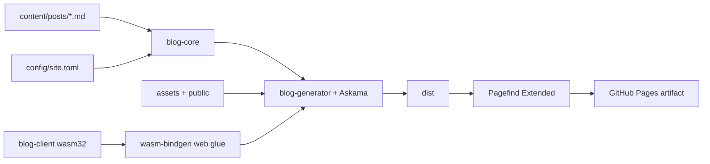

# 架构说明

## 构建数据流

## 关键决策

1. 静态优先：本站无数据库、鉴权和服务端 API，不引入常驻 Web 服务。
2. 渐进增强：页面正文、链接、SEO 在 WASM 或第三方 CDN 失败时仍可用。
3. 行为等价：旧站 7 篇内容、排序、阅读时长和相关规则用 fixture 锁定。
4. 子路径优先：所有本地 URL 由配置的 `/myBlog-rust` base path 生成。
5. 第三方边界：保留 Mermaid 与 giscus；不重写成熟图形引擎或评论后端。
6. 无 Node 生产依赖：Rust 与 Pagefind standalone 完成全部生产构建。

## 运行时

HTML 内联模块显式调用 wasm-bindgen 默认初始化，并传入 base-path-safe WASM URL。成功后写入 `data-rust-blog-ready=true`；失败只禁用增强交互，不影响静态内容。Pagefind 加载失败时保留 DOM 标题/标签/摘要筛选。Mermaid 和 giscus 均有可读降级。

## 内容与 SEO

frontmatter 失败包含源文件名和字段；draft 不输出。标题 ID、目录、canonical、trailing slash、RSS 日期、sitemap 和 JSON-LD 全部在构建期确定。`cargo xtask check` 检查路由、资源引用、SEO、WASM bootstrap、Pagefind 和 RSS。
