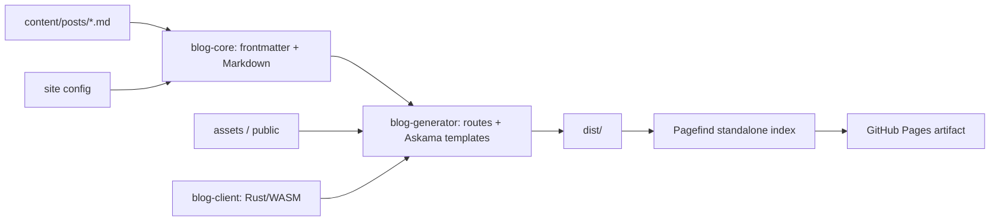

# myBlog Rust 重写计划

> 状态：实现与本地验收完成，等待 PR CI、合并和生产发布验收
> 基线日期：2026-07-31  
> 原仓库：`Cai-Tang-www/myBlog`  
> 原仓库基线：分支 `course-web`，提交 `d635a6d`  
> 建议新仓库：`Cai-Tang-www/myBlog-rust`

## 1. 目标与边界

### 1.1 总目标

用 Rust 重新实现当前博客的内容生成、页面结构、视觉设计、响应式布局、SEO 与浏览器交互，并保持 GitHub Pages 静态部署能力。

完成后的生产构建与运行不依赖 Node.js：

- Rust 在构建期解析 Markdown、生成全部静态页面与站点元数据；
- Rust/WASM 在浏览器中承担交互；
- Pagefind 使用官方独立二进制生成静态搜索索引；
- giscus、Mermaid 等适合保留的成熟第三方服务/渲染器继续使用；
- 输出目录可直接部署到 GitHub Pages、对象存储或任意静态服务器。

### 1.2 迁移原则

1. **先行为等价，再优化实现**：先保证路由、内容、界面和交互完整，再做 Rust 侧抽象。
2. **视觉意图一致，不盲目复刻缺陷**：保留设计语言和动效；移动端 typing 文案裁切、缺失 OG 图等明显问题在迁移时修复。
3. **内容源不改格式**：优先原样复用 `content/posts/*.md` 和现有 frontmatter，降低内容迁移风险。
4. **静态优先**：现状没有数据库、登录或服务端业务，第一版不引入常驻 Axum 服务。
5. **可回滚**：新旧仓库与部署先并行运行，验收通过后再切换自定义域名。
6. **小批提交**：骨架、内容、视觉、每类交互、SEO 和部署分别提交，避免一次性大爆炸重写。

### 1.3 首版不做的事情

- 不增加数据库、账号体系和管理后台；
- 不把浏览器本地留言板擅自改成服务器留言系统；
- 不重新实现 giscus 后端；
- 不自行重写 Mermaid 图形布局引擎；
- 不在旧仓库中混入大量 Rust 迁移提交；
- 不在未完成验收前替换当前生产站点。

如果以后需要真正的服务端留言、管理后台或 API，再增加独立的 Axum crate/service，不影响静态站点主体。

## 2. 当前项目基线结论

当前项目虽然使用 Next.js/React/TypeScript，但实际产品形态是静态博客，而不是依赖服务端进程的动态全栈应用：

- Next.js `output: "export"`；
- 文章来自本地 Markdown；
- GitHub Pages 静态部署；
- Pagefind 静态全文检索；
- giscus 提供评论；
- `/contact/` 留言只保存在浏览器 `localStorage`；
- 没有数据库、鉴权、服务端 API 或后台管理。

因此，Rust 重写最适合采用自研小型 SSG，而不是把每个请求交给动态 Web 服务。

## 3. 目标技术架构

### 3.1 推荐技术栈

| 层次 | 推荐方案 | 职责 |
|---|---|---|
| 内容模型 | `serde` + `gray_matter` | frontmatter 反序列化和校验 |
| Markdown | `pulldown-cmark` | Markdown/GFM 解析、HTML 生成 |
| 模板 | Askama | 编译期检查的 HTML 模板 |
| 日期 | `chrono` 或 `time` | 日期解析、排序、中文格式化 |
| 构建 CLI | Rust `xtask` | build/check/serve/index/deploy 编排 |
| 浏览器交互 | `wasm-bindgen` + `web-sys` | 目录、进度、留言、Canvas、回顶等 |
| CSS | 原生 CSS，迁移现有 CSS Modules 设计值 | 保持视觉控制和低运行时开销 |
| 搜索 | Pagefind standalone binary | 构建后生成静态索引 |
| 评论 | giscus | 原样保留第三方评论能力 |
| 图表 | Mermaid JS | 保留渲染器，Rust/WASM 管理加载与生命周期 |
| 部署 | GitHub Actions + GitHub Pages | 构建、校验、上传静态 artifact |

参考文档：

- Askama：https://docs.rs/askama/latest/askama/
- pulldown-cmark：https://docs.rs/pulldown-cmark/latest/pulldown_cmark/
- wasm-bindgen：https://wasm-bindgen.github.io/wasm-bindgen/
- Pagefind：https://pagefind.app/docs/
- GitHub Pages 自定义工作流：https://docs.github.com/en/pages/getting-started-with-github-pages/using-custom-workflows-with-github-pages
- giscus：https://giscus.app/zh-CN

### 3.2 数据与生成流程



### 3.3 建议仓库结构

```text
myBlog-rust/
├─ Cargo.toml
├─ Cargo.lock
├─ rust-toolchain.toml
├─ README.md
├─ crates/
│  ├─ blog-core/
│  │  ├─ src/content.rs
│  │  ├─ src/frontmatter.rs
│  │  ├─ src/markdown.rs
│  │  ├─ src/related.rs
│  │  ├─ src/seo.rs
│  │  └─ src/site.rs
│  ├─ blog-generator/
│  │  ├─ src/main.rs
│  │  ├─ src/routes.rs
│  │  ├─ src/render.rs
│  │  └─ src/server.rs
│  └─ blog-client/
│     ├─ src/lib.rs
│     ├─ src/canvas_nest.rs
│     ├─ src/toc.rs
│     ├─ src/search.rs
│     ├─ src/contact.rs
│     ├─ src/mermaid.rs
│     └─ src/back_to_top.rs
├─ xtask/
│  └─ src/main.rs
├─ templates/
│  ├─ base.html
│  ├─ home.html
│  ├─ blog.html
│  ├─ post.html
│  ├─ contact.html
│  ├─ not-found.html
│  └─ partials/
├─ assets/
│  ├─ css/
│  ├─ fonts/
│  └─ images/
├─ content/posts/
├─ public/
├─ config/site.toml
├─ tests/
│  ├─ fixtures/
│  ├─ snapshots/
│  ├─ browser/
│  └─ visual/
├─ dist/
└─ .github/workflows/
   ├─ ci.yml
   └─ deploy-pages.yml
```

`blog-core` 不依赖 DOM，可独立测试；`blog-generator` 只负责构建期；`blog-client` 编译为 WASM，只承担浏览器行为。

## 4. 完整迁移清单

### 4.1 路由与产物

| 当前产物 | Rust 目标 | 验收 |
|---|---|---|
| `/` | 首页静态 HTML | 内容、布局、动画和链接一致 |
| `/blog/` | 归档与搜索页 | 全部文章可见，Pagefind 可搜索 |
| `/blog/{slug}/` | 7 篇文章详情页 | 路由、正文、目录、评论一致 |
| `/contact/` | 本地留言板 | 校验、存储、toast、历史留言一致 |
| 404 | `404.html` | GitHub Pages 可正确使用 |
| `/rss.xml` | Rust 生成 RSS | 条目、链接、日期正确 |
| `/sitemap.xml` | Rust 生成 sitemap | 所有公开路由完整 |
| `/robots.txt` | Rust 生成或静态复制 | sitemap 地址正确 |
| `/BingSiteAuth.xml` | 原样复制 | 可公开访问 |
| favicon | 原样迁移 | 浏览器正常显示 |

所有页面继续使用 trailing slash，并支持可配置 base path，不能把根路径写死。

### 4.2 内容管线

必须完整迁移 `lib/posts.ts` 的行为：

- YAML frontmatter 字段：
  - `title`
  - `titleLines`
  - `summary`
  - `publishedAt`
  - `tags`
  - `cover`
  - `featured`
  - `featuredOrder`
  - `draft`
- build/check 阶段校验必填字段和日期；
- 过滤草稿；
- 按发布时间倒序；
- 精选文章按 `featuredOrder` 排序；
- 阅读时长按 240 words/minute 计算；
- 支持现有 Markdown/GFM；
- 提取 H1/H2/H3，依次注入 `section-N`；
- 生成文章目录数据；
- 正文图片增加 lazy loading 与 async decoding；
- 保留七牛/火山对象存储图片 URL 规则；
- 按标签交集计算相关文章；
- 中文日期格式化；
- 所有错误包含文章路径和字段名，便于修正文档。

内容迁移优先直接复制现有 7 篇 Markdown，不在首批中重写正文。

### 4.3 全局界面

- 设计 token：颜色、阴影、圆角、间距、字体、断点、层级；
- 全局页面背景和渐变；
- header 导航、当前路由状态；
- footer；
- 桌面和移动容器宽度；
- focus-visible、键盘导航和可访问性；
- `prefers-reduced-motion`；
- 所有内部链接统一经过 base-path helper；
- 图片保持当前比例与裁切策略；
- 页面刷新时避免明显 FOUC/布局跳动。

### 4.4 首页

- 个人介绍和视觉层级；
- 外部 typing SVG 改为本地 CSS/Rust-WASM typing 效果；
- 渐变 orb/morph 动画；
- 精选文章卡片与进场动画；
- 卡片标签、摘要、日期和阅读时长；
- 社交/操作按钮；
- 简历按钮继续提示“我还没写好...”；
- Canvas Nest 背景；
- 修复当前移动端 typing 文案裁切，但保持视觉意图。

### 4.5 博客归档页

- 标题、说明、文章数量；
- Pagefind 搜索输入和结果；
- 搜索 loading、空状态和失败降级；
- 标签/元数据展示；
- 文章卡片 hover、focus、入场效果；
- 搜索索引路径兼容根域名和 GitHub Pages 子路径；
- 静态服务器正确返回 `.js`、`.wasm` 和 Pagefind 资源 MIME。

### 4.6 文章详情页

- 标题、摘要、发布时间、阅读时长和标签；
- 封面图；
- 正文 Markdown 排版；
- 代码块、引用、表格、列表、链接和图片；
- Mermaid 动态加载与渲染；
- 右侧 sticky 目录；
- 滚动时目录 active 状态；
- 目录进度轨；
- 点击目录平滑滚动；
- URL hash 更新；
- 回到顶部按钮；
- 阅读百分比；
- 相关文章；
- giscus 评论与未配置/被拦截时的降级提示；
- 移动端隐藏或折叠桌面目录，不遮挡正文。

### 4.7 留言板

首版保持现在的浏览器本地语义：

- 昵称必填；
- 邮箱必填并进行格式校验；
- 留言内容必填；
- 字数计数与上限；
- `localStorage` 持久化；
- 成功 toast；
- 历史留言显示；
- DOM 内容使用安全文本节点，不拼接未转义 HTML；
- 存储 JSON 异常时能降级为空列表；
- localStorage 不可用时给出非阻断提示；
- 保持当前字段和卡片视觉设计。

未来若改成跨设备留言，应另开需求设计 API、反垃圾、审核、隐私和数据迁移。

### 4.8 动效与交互

- Canvas Nest：桌面 115 粒子、移动 55 粒子；
- 粒子连线和鼠标排斥；
- 页面/卡片进场动画；
- orb/morph；
- 本地 typing；
- 平滑滚动；
- 页面滚动进度；
- 回到顶部；
- reduced-motion 下禁用或显著简化非必要动画；
- 页面卸载时移除 listener、observer 和 animation frame；
- WASM 初始化失败时正文和导航仍可用，采用渐进增强。

### 4.9 SEO 与站点元数据

- `lang="zh-CN"`；
- title 模板；
- description、authors、keywords；
- canonical；
- robots；
- OpenGraph；
- Twitter Card；
- RSS alternate；
- Bing/Baidu/360 验证 meta；
- WebSite JSON-LD；
- Blog JSON-LD；
- Article JSON-LD；
- Breadcrumb JSON-LD；
- RSS、sitemap、robots；
- GitHub Pages base path；
- 自定义域名；
- 补齐当前不存在的默认 OG 图片；
- 站点描述从“采用 Next.js SSG 构建”更新为 Rust 实现，但不改变博客定位。

## 5. 分阶段实施计划

### Phase 0：冻结基线（0.5–1 个工作日）

产物：

- 固定原站基线 `course-web@d635a6d`；
- 保存 1280×720 与 390×844 的关键页面截图；
- 保存路由、DOM、meta、JSON-LD 和正文 HTML 快照；
- 建立功能验收矩阵；
- 标记“必须等价”和“迁移时修复”的差异。

退出条件：后续可以明确判断 Rust 版是功能回归还是有意改进。

### Phase 1：仓库与 Rust 骨架（0.5–1 个工作日）

产物：

- 安装 rustup、stable 和 `wasm32-unknown-unknown`；
- 创建 `Cai-Tang-www/myBlog-rust`；
- 初始化 Cargo workspace；
- 添加 `rust-toolchain.toml`；
- 建立 `blog-core`、`blog-generator`、`blog-client`、`xtask`；
- 实现 `cargo xtask build/check/serve` 基本命令；
- 配置 fmt、clippy、test、build CI；
- 预览服务器正确处理 HTML fallback 与 JS/WASM MIME。

退出条件：新仓库可在本地和 CI 生成并预览一个占位静态站点。

### Phase 2：内容与静态路由（2–3 个工作日）

产物：

- 迁移 7 篇 Markdown 和 public 资源；
- 完成 frontmatter、排序、阅读时长、目录、相关文章逻辑；
- 生成首页、归档、详情、留言、404；
- 生成 RSS/sitemap/robots 初版；
- 单元测试和 golden HTML 快照；
- 全站内部链接检查。

退出条件：无样式或基础样式状态下，全部内容、路由和元数据完整可访问。

### Phase 3：界面 1:1 迁移（2–4 个工作日）

产物：

- 迁移全局设计 token、header、footer；
- 迁移首页、归档、文章、留言、404 样式；
- 迁移卡片、标签、按钮、封面和正文排版；
- 适配 1280×720、390×844 及中间宽度；
- reduced-motion；
- 修复 typing 裁切等已确认缺陷。

退出条件：关闭 WASM 后，静态页面的布局与视觉已接近当前站点。

### Phase 4：Rust/WASM 功能填充（3–5 个工作日）

建议按功能拆成多个独立提交：

1. Canvas Nest；
2. typing、orb 和进场动画；
3. 文章目录、hash 和滚动进度；
4. 回到顶部；
5. 留言校验、localStorage、toast；
6. Mermaid loader；
7. giscus loader 与降级；
8. Pagefind UI 初始化与状态处理。

退出条件：当前交互矩阵全部通过，禁用 WASM 时仍有基础可用性。

### Phase 5：SEO、搜索与部署（1–2 个工作日）

产物：

- 完成所有 SEO meta 和 JSON-LD；
- 完成 RSS、sitemap、robots 验证；
- Pagefind standalone binary 集成；
- base path 和自定义域名处理；
- GitHub Actions CI；
- GitHub Pages preview/production workflow；
- 构建产物完整性校验。

退出条件：新仓库 Pages 地址可访问，搜索、资源、canonical 和 sitemap 地址正确。

### Phase 6：验收、并行上线与切换（2–3 个工作日）

产物：

- `cargo fmt --check`；
- `cargo clippy --workspace --all-targets -- -D warnings`；
- `cargo test --workspace`；
- WASM/browser 自动化测试；
- 链接与资源检查；
- HTML/SEO 快照对比；
- 桌面与移动视觉对比；
- 搜索、Mermaid、giscus、目录、留言手工回归；
- Lighthouse/无障碍基础检查；
- 新旧站并行观察；
- 验收后再切换自定义域名。

退出条件：验收矩阵无阻断项，旧站仍保留为回滚源。

### 总体工期

预计 **10–17 个工作日**。影响范围最大的变量是视觉像素级对齐、浏览器自动化基线稳定性，以及 Pagefind/Mermaid/giscus 在 GitHub Pages 子路径环境中的集成。

## 6. 建议提交批次

首批骨架：

1. `chore: initialize rust blog workspace`
2. `feat: add markdown content domain and fixtures`
3. `feat: generate static routes and base templates`
4. `test: add content and html snapshot coverage`
5. `ci: build and publish preview artifact`

后续：

6. `style: port global layout and responsive design`
7. `style: port home and archive pages`
8. `style: port article and contact pages`
9. `feat: add canvas and motion wasm interactions`
10. `feat: add article navigation and progress`
11. `feat: add local contact board interactions`
12. `feat: integrate mermaid giscus and pagefind`
13. `feat: generate complete seo metadata and feeds`
14. `ci: deploy rust blog to github pages`
15. `test: add visual and browser regression coverage`

每个批次都必须能构建；功能提交尽量同时包含测试。

## 7. 验收矩阵

### 7.1 构建质量

- [ ] Rust stable 可重复构建；
- [ ] Cargo lockfile 已提交；
- [ ] fmt 通过；
- [ ] clippy 零 warning；
- [ ] workspace tests 通过；
- [ ] WASM 构建通过；
- [ ] 无 Node 生产构建依赖；
- [ ] CI 与本地产物一致；
- [ ] 构建失败信息能定位到具体文章/模板/资源。

### 7.2 内容与路由

- [ ] 7 篇文章全部生成；
- [ ] 草稿不生成公开页；
- [ ] 排序、精选、阅读时长正确；
- [ ] H1/H2/H3 与 `section-N` 一致；
- [ ] 相关文章符合标签交集规则；
- [ ] trailing slash 一致；
- [ ] 根路径和 base path 都可用；
- [ ] 404、RSS、sitemap、robots、Bing 文件可访问；
- [ ] 内部链接和静态资源无 404。

### 7.3 视觉

- [ ] 1280×720 首页；
- [ ] 1280×720 归档；
- [ ] 1280×720 文章；
- [ ] 1280×720 留言；
- [ ] 390×844 首页；
- [ ] 390×844 文章；
- [ ] 中间宽度无明显断裂；
- [ ] 深色背景、卡片、排版、标签、按钮一致；
- [ ] typing 移动端不裁切；
- [ ] reduced-motion 正常。

### 7.4 交互

- [ ] Canvas 粒子数量和鼠标排斥；
- [ ] 卡片和页面动画；
- [ ] 简历按钮提示；
- [ ] Pagefind 可搜索中文文章；
- [ ] 搜索 loading/空/失败状态；
- [ ] 目录 active 和进度轨；
- [ ] 目录点击更新 hash 并平滑定位；
- [ ] Mermaid 转成 SVG；
- [ ] giscus 正常加载；
- [ ] giscus 未配置或被拦截时有提示；
- [ ] 回到顶部和阅读百分比；
- [ ] 留言校验、计数、持久化、toast、历史记录；
- [ ] localStorage 异常不导致页面崩溃；
- [ ] 移动端目录不遮挡正文。

### 7.5 SEO

- [ ] title/description/keywords/authors；
- [ ] canonical；
- [ ] OpenGraph/Twitter；
- [ ] 默认 OG 图片真实存在；
- [ ] RSS alternate；
- [ ] 搜索引擎验证 meta；
- [ ] WebSite/Blog/Article/Breadcrumb JSON-LD；
- [ ] `lang="zh-CN"`；
- [ ] sitemap URL 与生产域名一致；
- [ ] 文章 canonical 与 trailing slash 一致。

## 8. 当前基线已发现的问题

这些问题需要记录为迁移基线，不能误判成 Rust 版回归：

1. `npm ci` 因 lockfile 与 `package.json` 不同步失败，缺少 `@pagefind/freebsd-x64@1.5.2`；
2. `npm run check` 当前有 ESLint error：
   - `app/contact/page.tsx` 在 effect 中同步 `setState`；
   - `components/canvas-nest.tsx` 的 `dots` 应为 `const`；
3. 另有未使用变量和 `` 等 warning；
4. RSS 在构建时会执行两次：npm 自动运行 `prebuild`，`build` 又显式调用 `npm run prebuild`；
5. `siteConfig.ogImage` 指向 `/images/og-default.png`，实际文件不存在；
6. 普通 Python `http.server` 会把部分 JS 作为 `text/plain` 返回，导致 Pagefind dynamic import 失败；Rust 预览服务器必须正确设置 MIME；
7. 站点描述仍写着“采用 Next.js SSG 构建”，迁移后需更新；
8. 移动端首页 typing SVG 文案有裁切，Rust 版按设计意图修复。

## 9. 仓库和工作区策略

推荐新仓库：

- GitHub：`Cai-Tang-www/myBlog-rust`
- 本地：优先使用与旧仓库平级的 `C:\Users\Yun_Mu\Desktop\myBlog-rust`

用户允许在当前工作区创建目录。如果必须放在旧仓库内，则使用：

```text
C:\Users\Yun_Mu\Desktop\myBlog\rust-blog
```

同时把 `rust-blog/` 写入旧仓库的 `.git/info/exclude`，避免旧仓库把嵌套 Git 仓库记录成未跟踪目录。新仓库必须有独立 `.git`，不能污染旧仓库历史。

默认建议创建公开仓库；如果源码暂不公开，则在执行 `gh repo create` 前明确改为 private。

## 10. 风险与应对

| 风险 | 应对 |
|---|---|
| 自研 SSG 范围膨胀 | 只实现本站需要的模型和路由，不做通用框架 |
| Rust/WASM bundle 过大 | 按页面初始化、减少依赖、release 优化和压缩 |
| WASM 首屏失败影响正文 | 静态 HTML 优先，交互全部渐进增强 |
| Pagefind 子路径错误 | 根路径/base path 双场景集成测试 |
| Mermaid/giscus 外部脚本受 CSP/网络影响 | 明确 loading/error/blocked 降级 UI |
| 中文字数和阅读时长与旧版偏差 | 用现有 7 篇文章建立 fixture 对比 |
| HTML 输出与 remark 不完全一致 | golden snapshot + 浏览器渲染对比 |
| 像素级复刻耗时 | 先锁定关键断点和组件，再做差异收敛 |
| 自定义域名切换风险 | 新旧 Pages 并行，最后切 DNS/Pages 设置 |
| 本机当前无 Rust 工具链 | Phase 1 首先安装并锁定 toolchain |

## 11. 第一批执行清单

方案确认后，第一批按以下顺序执行：

1. 确认仓库名 `myBlog-rust` 和 public/private；
2. 用 `gh` 创建 `Cai-Tang-www/myBlog-rust`；
3. 在独立目录初始化 Git 与 Cargo workspace；
4. 安装/确认 Rust stable、rustfmt、clippy、WASM target；
5. 提交 placeholder SSG 和 `xtask`；
6. 添加 CI；
7. 复制内容 fixture，但暂不修改正文；
8. 生成第一版首页、归档、文章页骨架；
9. 本地启动 Rust 预览服务器并用浏览器检查；
10. 推送首批提交，报告构建结果、截图和剩余差异。

## 12. 决策待确认项

开始产生外部改动前只需确认两项：

1. 新仓库是否使用默认名称 `Cai-Tang-www/myBlog-rust`；
2. 新仓库是 public 还是 private（默认建议 public，与博客源码用途一致）。

其余实现细节可按本文默认方案推进，不需要每一步等待确认。
